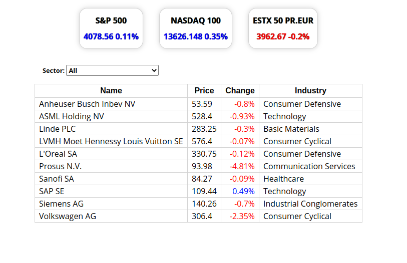

# Stock screener

## Table of Contents

- [About the Project](#about-the-project)
- [Built With](#built-with)
- [Live Demo](#live-demo)
- [Getting Started](#getting-started)
- [Authors](#authors)
- [Contributing](#contributing)
- [Show your support](#show-your-support)
- [License](#license)
- [Acknowledgements](#acknowledgements)

## About the Project

Stock screener built using [React](https://reactjs.org/) and [Redux](https://redux.js.org/).

This screener connects to [Financial Modeling Prep](https://financialmodelingprep.com/) API to get financial information.
You will be able to see the current level of the S&P 500, the NASDAQ , and the EUROSTOXX 50.

You can click on each Index and get information about the current price of the biggest index components by market cap.

If you select a sector the components of the Index will be filtered.

If you click on any Index component you will get additional information about that company.

## Built With

- [JavaScript](https://en.wikipedia.org/wiki/JavaScript)
- [React](https://reactjs.org/)
- [Redux](https://redux.js.org/)
- [Node package manager](https://www.npmjs.com/)
- [HTML5](https://en.wikipedia.org/wiki/HTML5)
- [CSS](https://www.w3schools.com/Css/)

## Live Demo

[Live Demo Link](https://zappat0n.github.io/screener/)

## Getting Started

To get a local copy up and running follow these simple example steps.

1. On the project GitHub page, navigate to the main page of the repository.
2. Under the repository name, locate and click on a green button named `Code`.
3. Copy the project URL as displayed.
4. If you're running the Windows Operating System, open your command prompt. On Linux, Open your terminal.
5. Change the current working directory to the location where you want the cloned directory to be made. Leave as it is if the current location is where you want the project to be.
6. Type git clone, and then paste the URL you copied in Step 3.  
   e.g. $ `git clone https://github.com/Zappat0n/screener.git`
7. Press Enter. Your local copy will be created.
8. On your console, move to the place where this folder is cloned
9. Get an API key from [Financial Modeling Prep](https://financialmodelingprep.com/developer)
10. Create a file named `.env` in the root folder of the application with this line `REACT_APP_API_KEY=[key from previous step]`
11. Run `npm start`, then server is automatically opened

## Authors

👤 **Angel Barros**

- GitHub: [@Zappat0n](https://github.com/Zappat0n)
- LinkedIn: [LinkedIn](https://www.linkedin.com/in/angel-barros/)

## Contributing

Contributions, issues, and feature requests are welcome!
Feel free to check the [issues page](../../issues).

1. Fork the Project
2. Create your Feature Branch (`git checkout -b feature/AmazingFeature`)
3. Commit your Changes (`git commit -m 'Add some AmazingFeature'`)
4. Push to the Branch (`git push origin feature/AmazingFeature`)
5. Open a Pull Request

## Show your support

Give a ⭐️ if you like this project!

## License

This project is [MIT](./LICENSE) licensed.

## Acknowledgements

- [Financial Modeling Prep](https://financialmodelingprep.com/developer)
- [React](https://reactjs.org/)
- [Redux](https://redux.js.org/)
